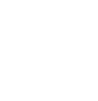

  

    

    

      <h5>Addiction Medicine Resources</h5>
      

        

          

            
          

          

            
Dedicated to educating physicians and improving the treatment of individuals suffering from alcoholism and other addictions.

          

        

        

          

            
CSAM is a specialty society of physicians founded in 1973.

          

          

            
          

        

      

      <a href="/addiction-resources" class="warning small button small-6 float-center">Learn More</a>
    

  

  

    

    

      <h5>Haight Ashbury Free Clinic &amp; Free Clinic Movement</h5>
      <ul>

      </ul>
    

  

  

    

    

      <h5>Haight Ashbury Neighborhood</h5>
      <ul>

      </ul>
    

  

  

    

    

      <h5>Resources</h5>
      <ul>

      </ul>
    

  

